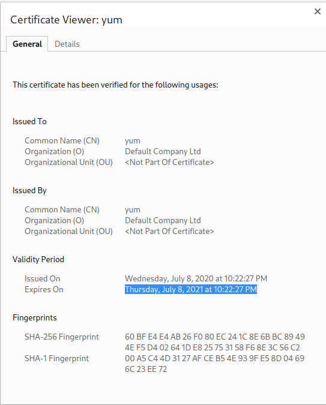
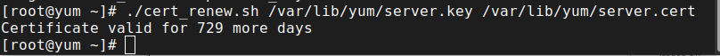

# Automated Renewal of Self-Signed Certificates  
**Usage**  
```
./cert_renew.sh /path/to/privatekey /path/to/x509 trigger
```  
The expiration date is checked regularly and based on a days remaining calculation, a new certificate is generated using DN information specified within cert_vars.sh  

## Trigger
The trigger is a value passed in that is used to determine when a new certificate should be generated. The default value is 14 days out from the current certificates expiration date.  

## Example ##
### Showing old certificate expiration ###
  
### Renewing certificate (I used a custom trigger of 365 days to force renewal) ###
  
### Verifying new certificate expiration ###
  
### Checking if certificate needs renewed again ###
  
